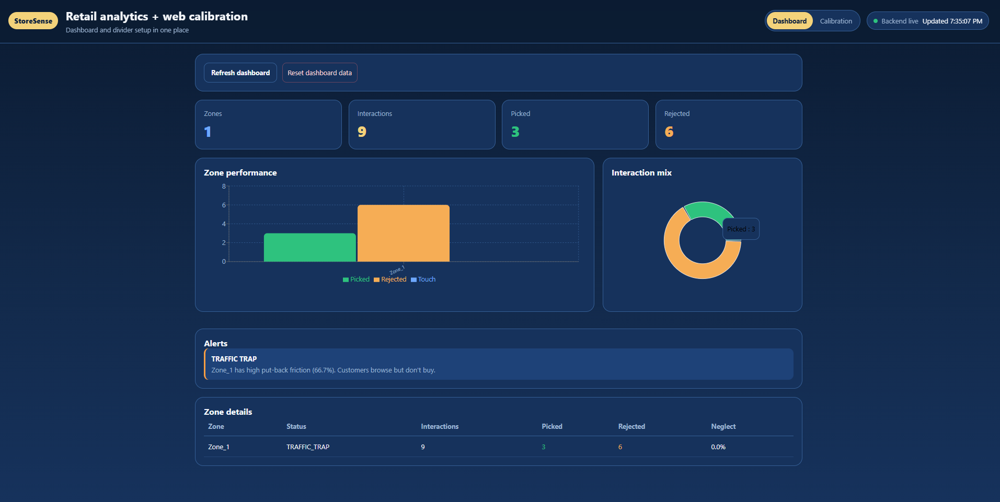
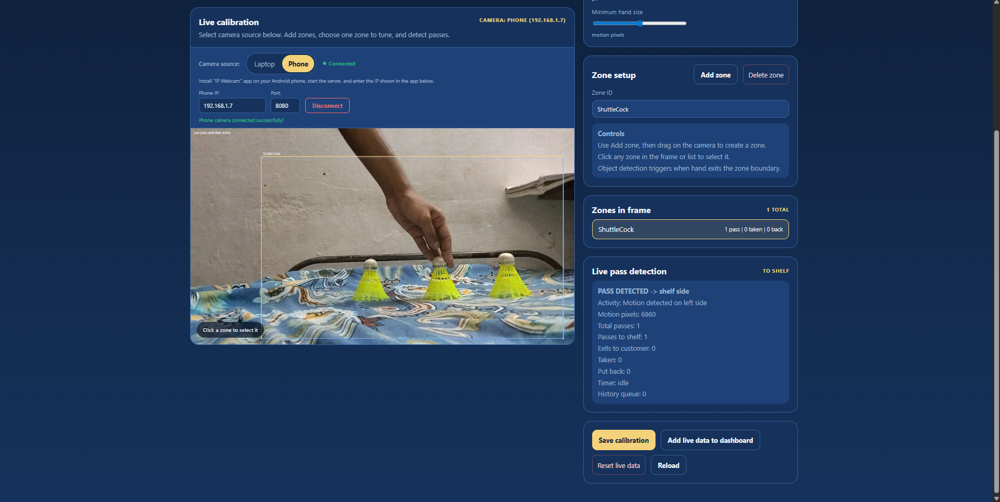
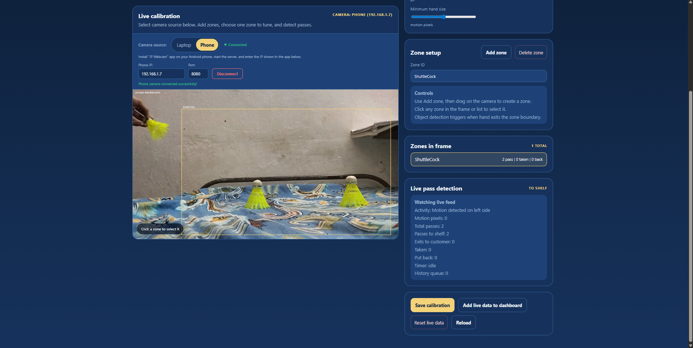
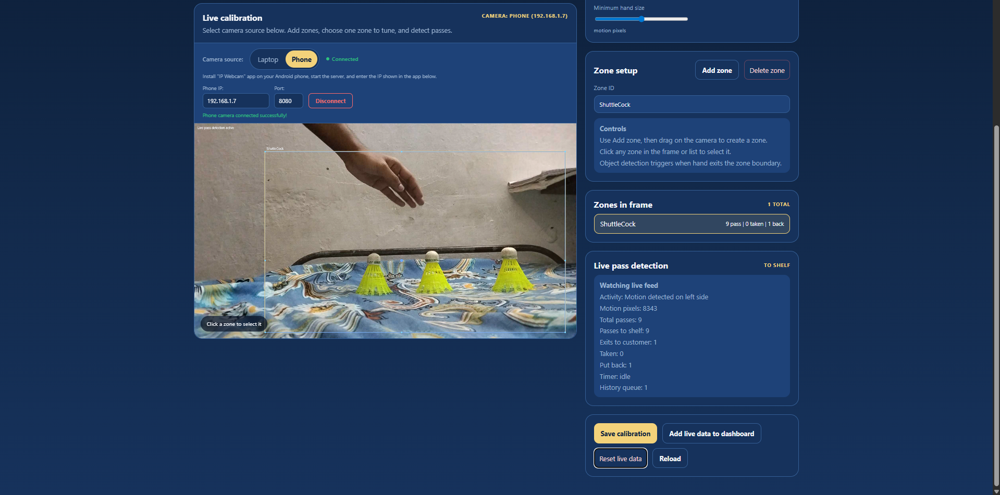

# StoreSense - AI-Powered Retail Analytics System

<div align="center">



**An end-to-end computer vision solution for tracking customer interactions with retail shelf products**

[](https://nodejs.org/)
[](https://www.python.org/)
[](https://reactjs.org/)
[](LICENSE)

</div>

---

## Table of Contents

- [Overview](#overview)
- [Key Features](#key-features)
- [System Architecture](#system-architecture)
- [Technology Stack](#technology-stack)
- [Project Structure](#project-structure)
- [Installation](#installation)
- [Configuration](#configuration)
- [Usage Guide](#usage-guide)
- [API Reference](#api-reference)
- [Dashboard Screenshots](#dashboard-screenshots)
- [How It Works](#how-it-works)
- [Deployment](#deployment)
- [Contributing](#contributing)

---

## Overview

**StoreSense** is a comprehensive retail analytics platform that uses computer vision to track and analyze customer interactions with products on store shelves. The system detects when customers pick up items, put them back, or simply browse without taking action - providing valuable insights for inventory management, product placement optimization, and customer behavior analysis.

### The Problem It Solves

Traditional retail analytics rely on point-of-sale data, which only captures purchases. StoreSense fills the gap by tracking:

- **Conversion Friction**: Items picked up but returned to shelf (rejected)
- **Discovery Friction**: Zones that receive little customer attention (cold zones)
- **Hot Zones**: High-traffic areas with frequent product interactions
- **Traffic Traps**: Areas where customers browse but rarely purchase

---

## Key Features

### Computer Vision Engine
- **Real-time Hand Tracking** using MediaPipe for accurate gesture detection
- **Tripwire/Divider Detection** to track hand movement across shelf boundaries
- **Object Change Detection** using background subtraction (works with ANY products)
- **Multi-zone Support** for tracking multiple shelf areas simultaneously
- **Optional YOLOv8 Integration** for advanced object recognition

### Analytics Dashboard
- **Real-time Metrics** with auto-refresh capabilities
- **Zone Performance Charts** showing pick vs reject ratios
- **Conversion Rate Analysis** per zone
- **Automated Alerts** for cold zones, hot zones, and traffic traps
- **Interactive Calibration Studio** for web-based zone configuration

### Backend Infrastructure
- **REST API** for telemetry ingestion and analytics retrieval
- **SQLite Database** for lightweight deployment (no external database required)
- **MongoDB Support** for production scalability
- **Offline-Resilient Queue** for edge deployments with intermittent connectivity

---

## System Architecture

```
+------------------+     +-------------------+     +------------------+
|                  |     |                   |     |                  |
|  Python Vision   |---->|  Node.js Backend  |---->|  React Dashboard |
|  Engine (Edge)   |     |  (REST API)       |     |  (Frontend)      |
|                  |     |                   |     |                  |
+------------------+     +-------------------+     +------------------+
        |                        |                        |
        v                        v                        v
+------------------+     +-------------------+     +------------------+
|  MediaPipe +     |     |  SQLite/MongoDB   |     |  Recharts +      |
|  OpenCV + YOLO   |     |  Database         |     |  Real-time UI    |
+------------------+     +-------------------+     +------------------+
```

### Data Flow

1. **Video Capture**: Edge Python script captures frames from camera (webcam, RTSP, or HTTP stream)
2. **Hand Detection**: MediaPipe identifies and tracks hands in each frame
3. **Zone Analysis**: State machine processes hand movements relative to calibrated zones
4. **Event Generation**: PICK/REJECT/TOUCH events are generated based on tripwire crossings
5. **Telemetry Transmission**: Events are queued and sent to backend API
6. **Analytics Aggregation**: Backend calculates conversion rates, neglect rates, and alerts
7. **Dashboard Display**: React frontend visualizes data with interactive charts

---

## Technology Stack

| Layer | Technologies |
|-------|-------------|
| **Computer Vision** | Python 3.8+, OpenCV, MediaPipe, YOLOv8, DeepSORT |
| **Backend API** | Node.js 18+, Express.js, SQLite (sql.js) / MongoDB |
| **Frontend Dashboard** | React 18, Recharts, Axios |
| **Offline Queue** | SQLite (embedded queue with background sync) |
| **Deployment** | Systemd services, Linux/Windows compatible |

---

## Project Structure

```
storesense/
├── backend/                    # Node.js API Server
│   ├── server.js              # SQLite-based server (lightweight)
│   ├── server-mongo.js        # MongoDB-based server (production)
│   ├── package.json           # Backend dependencies
│   └── .env.example           # Environment configuration template
│
├── frontend/                   # React Dashboard
│   ├── src/
│   │   ├── App.js             # Main application with Dashboard + Calibration
│   │   └── components/        # Reusable UI components
│   ├── public/                # Static assets
│   └── package.json           # Frontend dependencies
│
├── deploy/                     # Deployment configurations
│   ├── storesense.service     # Systemd service for Python engine
│   └── storesense-api.service # Systemd service for Node.js backend
│
├── public/                     # Screenshots and assets
│   ├── Dashboard.png          # Main dashboard screenshot
│   ├── 1.png                  # Implementation step 1
│   ├── 2.png                  # Implementation step 2
│   └── 3.png                  # Implementation step 3
│
├── store_sense_calibrator.py  # Phase 1: ROI calibration tool
├── store_sense_engine.py      # Phase 2: Core vision processing engine
├── store_sense_recalibrator.py # Phase 3: Recalibration utility
├── store_sense_yolo_deepsort.py # Alternative: YOLO + DeepSORT tracker
├── telemetry_sender.py        # Phase 4: Direct HTTP telemetry sender
├── telemetry_queue.py         # Phase 5: Offline-resilient queue
├── config.json                # ROI and global settings configuration
├── requirements.txt           # Python dependencies
└── README.md                  # This documentation
```

---

## Installation

### Prerequisites

- **Python 3.8+** with pip
- **Node.js 18+** with npm
- **Webcam** or IP camera for video feed

### Step 1: Clone the Repository

```bash
git clone <repository-url>
cd storesense
```

### Step 2: Install Python Dependencies

```bash
pip install -r requirements.txt
```

This installs:
- `opencv-python` - Computer vision library
- `mediapipe` - Hand tracking
- `ultralytics` - YOLOv8 object detection (optional)
- `deep-sort-realtime` - Multi-object tracking (optional)

### Step 3: Install Backend Dependencies

```bash
cd backend
npm install
```

### Step 4: Install Frontend Dependencies

```bash
cd ../frontend
npm install
```

### Step 5: Build Frontend (Optional - for production)

```bash
npm run build
```

---

## Configuration

### Environment Variables

Create a `.env` file in the `backend/` directory:

```env
# Server Configuration
PORT=3001
NODE_ENV=development

# MongoDB Connection (optional - for production)
MONGODB_URI=mongodb://localhost:27017/storesense

# Store Identification (optional - for multi-store deployments)
STORE_ID=store-001
```

### Calibration Configuration

The system uses `config.json` to store calibration settings:

```json
{
  "version": "3.0",
  "rtsp_url": "0",
  "calibration_timestamp": "2024-01-15 10:30:00",
  "global_settings": {
    "store_open_time": "08:00",
    "store_close_time": "22:00",
    "interaction_friction_window": 10,
    "decision_window": 5
  },
  "rois": [
    {
      "zone_id": "Shelf_1_Snacks",
      "x": 100,
      "y": 150,
      "width": 300,
      "height": 200,
      "tripwire": [[250, 150], [250, 350]],
      "shelf_side": "right"
    }
  ]
}
```

---

## Usage Guide

### Running the Complete System

#### Terminal 1: Start Backend API

```bash
cd backend
npm start
```

The API server will start on `http://localhost:3001`

#### Terminal 2: Start Frontend Dashboard

```bash
cd frontend
npm start
```

The dashboard will open at `http://localhost:3000`

#### Terminal 3: Run Calibration (First Time Setup)

```bash
python store_sense_calibrator.py
```

Follow the interactive prompts to:
1. Enter store hours and friction window settings
2. Connect to camera feed
3. Draw ROI zones on the video frame
4. Position vertical dividers within each zone
5. Save configuration to `config.json`

#### Terminal 3: Run Vision Engine (After Calibration)

```bash
python store_sense_engine.py
```

The engine will:
- Load configuration from `config.json`
- Connect to the camera feed
- Process frames in real-time
- Send telemetry events to the backend API

### Using the Dashboard

The dashboard provides two main views:

1. **Dashboard Mode**: View real-time analytics
   - Summary cards showing total zones, interactions, picks, and rejects
   - Bar chart comparing zone performance
   - Pie chart showing interaction mix
   - Alerts panel for zone health warnings
   - Detailed zone table with metrics

2. **Calibration Mode**: Configure zones via web interface
   - Live camera preview with zone overlay
   - Add/delete zones by drawing on video
   - Adjust store settings (hours, friction window)
   - Test detection with live pass visualization
   - Export session events to dashboard history

---

## API Reference

### Telemetry Endpoints

#### POST `/api/telemetry`

Receive telemetry events from the edge Python script.

**Request Body** (Single Event):
```json
{
  "timestamp": 1705312200,
  "zone_id": "Shelf_1_Snacks",
  "event": "PICKED",
  "neglect_rate_pct": 5.2
}
```

**Request Body** (Batch):
```json
{
  "events": [
    { "timestamp": 1705312200, "zone_id": "Shelf_1", "event": "PICKED" },
    { "timestamp": 1705312250, "zone_id": "Shelf_2", "event": "REJECTED" }
  ]
}
```

**Response**:
```json
{
  "success": true,
  "processed": 2,
  "results": [
    { "success": true, "zone_id": "Shelf_1", "event": "PICKED" },
    { "success": true, "zone_id": "Shelf_2", "event": "REJECTED" }
  ]
}
```

### Analytics Endpoints

#### GET `/api/analytics/summary`

Get aggregated analytics for all zones.

**Response**:
```json
{
  "timestamp": "2024-01-15T10:30:00.000Z",
  "summary": {
    "total_zones": 3,
    "total_interactions": 150,
    "total_taken": 95,
    "total_put_back": 45,
    "avg_neglect_rate": "12.5"
  },
  "zones": [
    {
      "zone_id": "Shelf_1_Snacks",
      "total_interactions": 50,
      "total_taken": 35,
      "total_put_back": 12,
      "total_touch": 3,
      "conversion_rate": 70.0,
      "friction_rate": 24.0,
      "neglect_rate": 8.5,
      "status": "NORMAL",
      "last_interaction": "2024-01-15T10:29:45.000Z"
    }
  ],
  "alerts": [
    {
      "type": "HOT_ZONE",
      "severity": "success",
      "zone_id": "Shelf_1_Snacks",
      "message": "Shelf_1_Snacks is performing well with 35 items taken!",
      "metric": 35
    }
  ]
}
```

#### GET `/api/analytics/zones/:zoneId`

Get detailed analytics for a specific zone.

#### GET `/api/analytics/hourly`

Get hourly statistics for the last 24 hours.

#### POST `/api/analytics/reset`

Clear all stored telemetry and reset analytics.

### Configuration Endpoints

#### GET `/api/calibration-config`

Retrieve the current calibration configuration.

#### POST `/api/calibration-config`

Save a new calibration configuration.

### Utility Endpoints

#### GET `/api/health`

Health check endpoint.

**Response**:
```json
{
  "status": "healthy",
  "uptime": 3600.5,
  "timestamp": "2024-01-15T10:30:00.000Z",
  "database": "sqlite (sql.js)",
  "version": "4.0"
}
```

#### GET `/api/events/recent`

Get recent telemetry events (default: 50).

#### DELETE `/api/events/cleanup?days=30`

Clean up events older than specified days.

---

## Dashboard Screenshots

### Main Analytics Dashboard

The dashboard provides a comprehensive view of retail shelf analytics:


**Key Components:**
- **Summary Cards**: Quick metrics at a glance (zones, interactions, picks, rejects)
- **Zone Performance Chart**: Bar chart comparing picked vs rejected items per zone
- **Interaction Mix**: Pie chart showing overall breakdown of customer actions
- **Alerts Panel**: Automated warnings for underperforming or high-traffic zones
- **Zone Details Table**: Detailed metrics including conversion and neglect rates

### Implementation Process

The following screenshots demonstrate the step-by-step implementation workflow:

#### Step 1: Zone Calibration Setup



*Drawing ROI zones on the camera feed to define shelf monitoring areas*

#### Step 2: Divider Positioning



*Positioning vertical dividers to detect hand crossing between customer and shelf sides*

#### Step 3: Live Detection Active



*Real-time hand tracking and pick/reject detection in action*

---

## How It Works

### Detection Algorithm

StoreSense uses a **tripwire/divider-based detection** approach:

```
                    TRIPWIRE (Vertical Divider)
                           |
    CUSTOMER SIDE          |         SHELF SIDE
         <----             |              ---->
                           |
    [Hand enters zone]     |
                           |
    [Hand crosses IN]  --->|---> [Tracking starts]
                           |
    [Hand crosses OUT] <---|<--- [Decision window starts (5s)]
                           |
         IF hand returns   |     IF timeout expires
         within 5s:        |     without return:
              |            |            |
              v            |            v
         REJECTED          |        PICKED
    (item put back)        |   (item taken)
```

### State Machine

Each zone maintains its own state:

1. **IDLE**: No hand interaction detected
2. **HAND_IN_ZONE**: Hand is currently inside the ROI boundary
3. **DECISION_WINDOW**: Hand exited zone, 5-second window to determine outcome

### Event Types

| Event | Description | Trigger Condition |
|-------|-------------|-------------------|
| **PICKED** | Customer took an item | Hand exited to customer side, no return within 5s |
| **REJECTED** | Customer put item back | Hand returned to shelf side within decision window |
| **TOUCH** | Brief interaction | Hand entered but left quickly without crossing divider |

---

## Deployment

### Linux Systemd Services

Two systemd service files are provided in the `deploy/` directory:

#### Python Vision Engine Service

```ini
# /etc/systemd/system/storesense.service
[Unit]
Description=StoreSense Vision Engine
After=network.target

[Service]
Type=simple
User=storesense
WorkingDirectory=/opt/storesense
ExecStart=/usr/bin/python3 store_sense_engine.py
Restart=always
RestartSec=10

[Install]
WantedBy=multi-user.target
```

#### Node.js API Service

```ini
# /etc/systemd/system/storesense-api.service
[Unit]
Description=StoreSense API Server
After=network.target

[Service]
Type=simple
User=storesense
WorkingDirectory=/opt/storesense/backend
ExecStart=/usr/bin/node server.js
Restart=always
RestartSec=10

[Install]
WantedBy=multi-user.target
```

### Enable and Start Services

```bash
sudo systemctl daemon-reload
sudo systemctl enable storesense storesense-api
sudo systemctl start storesense storesense-api
```

### Using MongoDB for Production

For high-volume production deployments, use the MongoDB-backed server:

```bash
cd backend
npm run start:mongo
```

Ensure `MONGODB_URI` is set in your `.env` file.

---

## Performance Optimization

### Edge Deployment Tips

1. **Reduce Frame Resolution**: Lower camera resolution (720p instead of 1080p) for faster processing
2. **Adjust Detection Confidence**: Lower MediaPipe confidence thresholds for faster but less accurate detection
3. **Use Offline Queue**: Enable `use_offline_queue=True` for intermittent connectivity environments
4. **Limit Zones**: More zones = more processing; optimize zone placement

### Backend Scaling

1. **Use MongoDB**: For multi-store deployments with high event volumes
2. **Add Caching**: Implement Redis for frequently accessed analytics
3. **Load Balancing**: Deploy multiple API instances behind a load balancer

---

## Troubleshooting

### Common Issues

#### Camera Not Detected

```
Error: Failed to access camera
```

**Solution**: Ensure camera permissions are granted. On Linux, check `/dev/video0` permissions.

#### Hand Detection Not Working

**Solution**: Ensure proper lighting. MediaPipe works best with:
- Even lighting without harsh shadows
- High contrast between hand and background
- Camera positioned at appropriate angle

#### Events Not Appearing in Dashboard

**Solution**: 
1. Check backend is running: `curl http://localhost:3001/api/health`
2. Verify Python engine is sending telemetry
3. Check browser console for CORS errors

---

## Contributing

Contributions are welcome! Please follow these steps:

1. Fork the repository
2. Create a feature branch (`git checkout -b feature/amazing-feature`)
3. Commit your changes (`git commit -m 'Add amazing feature'`)
4. Push to the branch (`git push origin feature/amazing-feature`)
5. Open a Pull Request

---

## License

This project is licensed under the MIT License - see the [LICENSE](LICENSE) file for details.

---

## Acknowledgments

- **MediaPipe** by Google for hand tracking
- **Ultralytics** for YOLOv8 object detection
- **Recharts** for beautiful React charts
- **sql.js** for in-browser SQLite

---

<div align="center">

**Built with :heart: by the StoreSense Team**

[Report Bug](../../issues) | [Request Feature](../../issues) | [Documentation](../../wiki)

</div>
